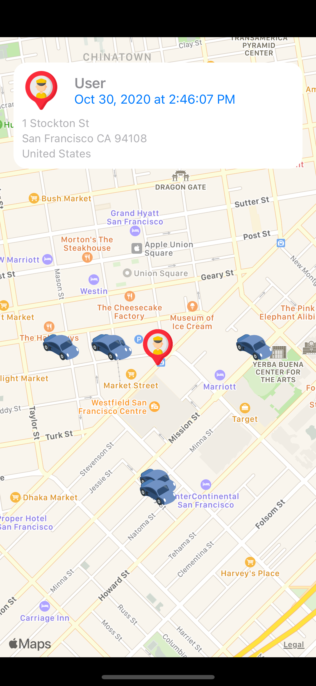
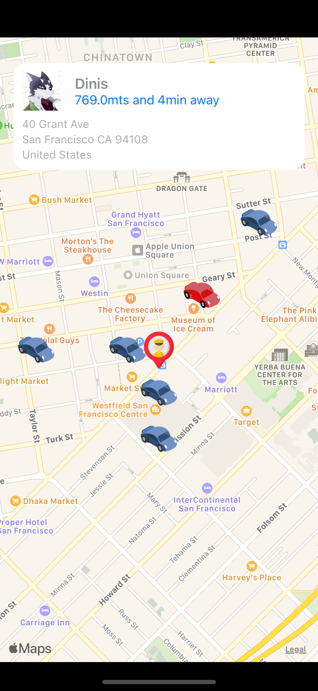
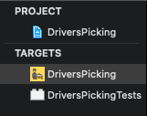
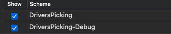

# DriversPicking 

## Overview:

This project is intentionally open-ended. The goal of this project is to show the use of Apple API's usage and Reactive Programming.

## App Premise:

- The user when entered for the first time it will be asked to use the current location, whem the app is in use.
- All placemarks will be custom, one for the drivers and one for the user
- The app will generate random Coordinates and position the drivers previously fetched in the map. The positions will always be near the user locations.
- The app will refresh the drivers position every 5 seconds as well as the user positions if needed.
- If a driver is selected, the app will have an info view showing the current address, name, image from the driver and the distance/time from the user location.
- Also, if selected, the driver will have a different image on the map to distinguish it from the other drivers.
- The driver can be unselected by clicking in the car selected.
- If a driver is not selected there will be an info view showing the current address, name (USER), image (placeholder) and date.

## Screenshots
  

## Code

### Targets

- There are two targets in this app, one for the main App ```DriversPicking``` and another for the Unit Testing ```DriversPickingTests```.



### Schemes

- There are two schemes for this app, Debug and Release, to test the full app you must use the ```DriversPicking-Debug```.



### Dependencies

- This project uses ```CocoaPods``` for dependency manager.
- This projects depends on: ```RxSwift``` and ```RxCocoa``` for ```DriversPicking``` target. target.
- Before running this project you must run ```pod install``` in order to have all the pods in order to install them.

```shell
target 'DriversPicking' do
  # Comment the next line if you don't want to use dynamic frameworks
  use_frameworks!

  # Pods for DriversPicking
  pod 'RxSwift'
  pod 'RxCocoa'

  target 'DriversPickingTests' do
    inherit! :search_paths
    # Pods for testing
    pod 'RxTest'
    pod 'RxBlocking'
  end

end
```

### API

- To fetch the drivers this app uses https://sheetdb.io as database.
- For debug it uses https://docs.google.com/spreadsheets/d/1qU-g9jqvtvtKwrGT0LI5Zbpp_N1PWBsCF4FWk6nkv1k/edit?usp=sharing and final link https://sheetdb.io/api/v1/pc1ght2w5p69l
- For release it uses https://docs.google.com/spreadsheets/d/1tjkHrK58WL-iSPeeBrA0MjjcTPhCccrXp8tmwbIM4hw/edit?usp=sharing and final link https://sheetdb.io/api/v1/s0r5i7rkd05p1
- Both requests are GET.

```swift
{
"id": String,
"name": String,
"image": String, // optional
}
```

### Tests

- This app uses ```RxTest``` and ```RxBlocking``` for ```DriversPickingTests```.
